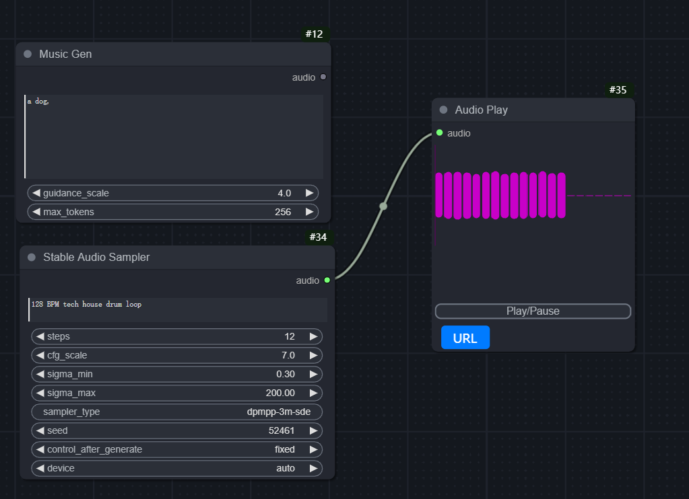

> [寻求帮助 Mixlab nodes discord](https://discord.gg/cXs9vZSqeK)

> [推荐：mixlab-nodes](https://github.com/shadowcz007/comfyui-mixlab-nodes)




## 模型
[musicgen-small](https://huggingface.co/facebook/musicgen-small) 放到文件夹 models/musicgen/：


下载[stable-audio-open](https://huggingface.co/stabilityai/stable-audio-open-1.0) 到文件夹：
```ComfyUI\models\stable_audio\model.safetensors```


## 声音长度
长度（秒）= 样本大小 / 样本率
"sample_size": 2097152,
"sample_rate": 44100,

sample_size/sample_rate =47.55s

## 安装
测试机器：
torch 2.2.2+cu121 

下载 [flash-attention](https://github.com/bdashore3/flash-attention/releases/download/v2.5.2/flash_attn-2.5.2+cu122torch2.2.0cxx11abiFALSE-cp311-cp311-win_amd64.whl)

到comfyui-sound-lab 目录下，然后双击 ```install.bat``` ，适配window的安装包

如果安装失败，可以查看下报错信息，欢迎反馈